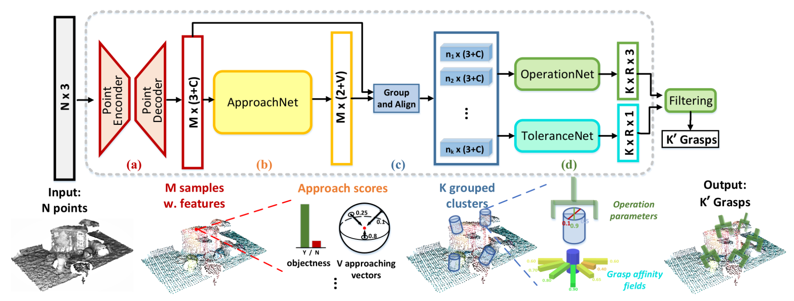
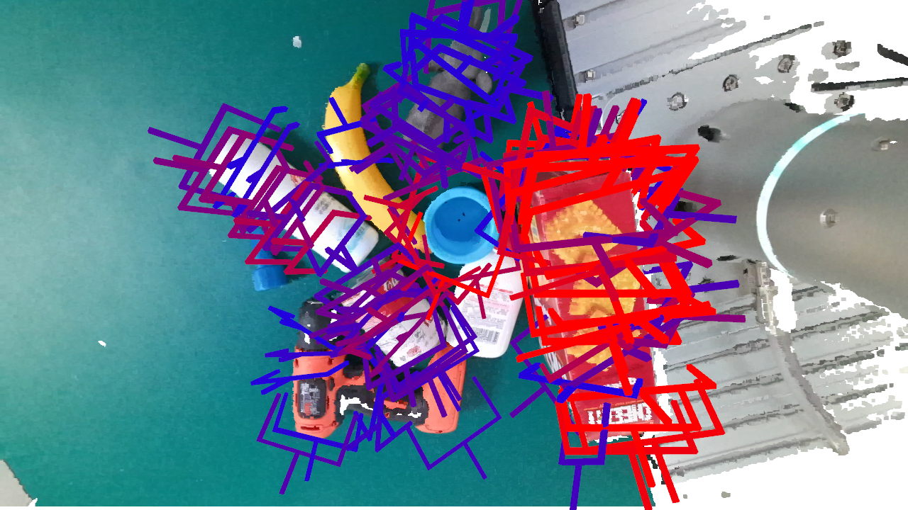

# GraspNet Baseline
Baseline model for "GraspNet-1Billion: A Large-Scale Benchmark for General Object Grasping" (CVPR 2020).

[[paper](https://openaccess.thecvf.com/content_CVPR_2020/papers/Fang_GraspNet-1Billion_A_Large-Scale_Benchmark_for_General_Object_Grasping_CVPR_2020_paper.pdf)]
[[dataset](https://graspnet.net/)]
[[API](https://github.com/graspnet/graspnetAPI)]
[[doc](https://graspnetapi.readthedocs.io/en/latest/index.html)]

<div align="center">    
    
    
    
    <br> Top 50 grasps detected by baseline model.
</div>



## Requirements
- Python 3
- PyTorch 1.6
- Open3d 0.8
- TensorBoard 2.3
- NumPy
- SciPy
- Pillow
- tqdm

## Installation
Get the code.
```bash
git clone https://github.com/graspnet/graspnet-baseline.git
cd graspnet-baseline
```
Install packages via Pip.
```bash
pip install -r requirements.txt
```
Compile and install pointnet2 operators. (Code adapted from [votenet](https://github.com/facebookresearch/votenet))
```bash
cd pointnet2
python setup.py install
```
Compile and install knn operator. (Code adapted from [pytorch_knn_cuda](https://github.com/chrischoy/pytorch_knn_cuda))
```bash
cd knn
python setup.py install
```
Install graspnetAPI for evaluation.
```bash
git clone https://github.com/graspnet/graspnetAPI.git
cd graspnetAPI
pip install .
```

## Tolerance Label Generation
Tolerance labels are not included in the original dataset, and need additional generation. Make sure you have downloaded the orginal dataset from [GraspNet](https://graspnet.net/). The generation code is in [dataset/generate_tolerance_label.py](dataset/generate_tolerance_label.py). You can simply generate tolerance label by running the script: (`--dataset_root` and `--num_workers` should be specified according to your settings)
```bash
cd dataset
sh command_generate_tolerance_label.sh
```

Or you can download the tolerance labels from [Google Drive](https://drive.google.com/file/d/1DcjGGhZIJsxd61719N0iWA7L6vNEK0ci/view?usp=sharing)/[Baidu Pan](https://pan.baidu.com/s/1HN29P-csHavJF-R_wec6SQ) and run:
```bash
mv tolerance.tar dataset/
cd dataset
tar -xvf tolerance.tar
```

## Training and Testing
Training examples are shown in [command_train.sh](command_train.sh). `--dataset_root`, `--camera` and `--log_dir` should be specified according to your settings. You can use TensorBoard to visualize training process.

Testing examples are shown in [command_test.sh](command_test.sh), which contains inference and result evaluation. `--dataset_root`, `--camera`, `--checkpoint_path` and `--dump_dir` should be specified according to your settings. Set `--collision_thresh` to -1 for fast inference.

The pretrained weights can be downloaded from:

- `checkpoint-rs.tar`
[[Google Drive](https://drive.google.com/file/d/1hd0G8LN6tRpi4742XOTEisbTXNZ-1jmk/view?usp=sharing)]
[[Baidu Pan](https://pan.baidu.com/s/1Eme60l39tTZrilF0I86R5A)]
- `checkpoint-kn.tar`
[[Google Drive](https://drive.google.com/file/d/1vK-d0yxwyJwXHYWOtH1bDMoe--uZ2oLX/view?usp=sharing)]
[[Baidu Pan](https://pan.baidu.com/s/1QpYzzyID-aG5CgHjPFNB9g)]

`checkpoint-rs.tar` and `checkpoint-kn.tar` are trained using RealSense data and Kinect data respectively.

## Demo
A demo program is provided for grasp prediction and visualization using RGB-D images. You can refer to [command_demo.sh](command_demo.sh) to run the program (`--checkpoint_path` should be specified according to your settings). Make sure you have downloaded the pretrained weights before running the program. The output should be similar to the following example:

<div align="center">    
    
</div>

## Results
"In repo" results report the model performance with single-view collision detection as post-processing. In evaluation we set `--collision_thresh` to 0.01.

Evaluation results on RealSense camera:
|          |        | Seen             |                  |        | Similar          |                  |        | Novel            |                  | 
|:--------:|:------:|:----------------:|:----------------:|:------:|:----------------:|:----------------:|:------:|:----------------:|:----------------:|
|          | __AP__ | AP<sub>0.8</sub> | AP<sub>0.4</sub> | __AP__ | AP<sub>0.8</sub> | AP<sub>0.4</sub> | __AP__ | AP<sub>0.8</sub> | AP<sub>0.4</sub> |
| In paper | 27.56  | 33.43            | 16.95            | 26.11  | 34.18            | 14.23            | 10.55  | 11.25            | 3.98             |
| In repo  | 47.47  | 55.90            | 41.33            | 42.27  | 51.01            | 35.40            | 16.61  | 20.84            | 8.30             |

Evaluation results on Kinect camera:
|          |        | Seen             |                  |        | Similar          |                  |        | Novel            |                  | 
|:--------:|:------:|:----------------:|:----------------:|:------:|:----------------:|:----------------:|:------:|:----------------:|:----------------:|
|          | __AP__ | AP<sub>0.8</sub> | AP<sub>0.4</sub> | __AP__ | AP<sub>0.8</sub> | AP<sub>0.4</sub> | __AP__ | AP<sub>0.8</sub> | AP<sub>0.4</sub> |
| In paper | 29.88  | 36.19            | 19.31            | 27.84  | 33.19            | 16.62            | 11.51  | 12.92            | 3.56             |
| In repo  | 42.02  | 49.91            | 35.34            | 37.35  | 44.82            | 30.40            | 12.17  | 15.17            | 5.51             |

## Citation
Please cite our paper in your publications if it helps your research:
```
@inproceedings{fang2020graspnet,
  title={GraspNet-1Billion: A Large-Scale Benchmark for General Object Grasping},
  author={Fang, Hao-Shu and Wang, Chenxi and Gou, Minghao and Lu, Cewu},
  booktitle={Proceedings of the IEEE/CVF Conference on Computer Vision and Pattern Recognition(CVPR)},
  pages={11444--11453},
  year={2020}
}
```

## License
All data, labels, code and models belong to the graspnet team, MVIG, SJTU and are freely available for free non-commercial use, and may be redistributed under these conditions. For commercial queries, please drop an email at fhaoshu at gmail_dot_com and cc lucewu at sjtu.edu.cn .
